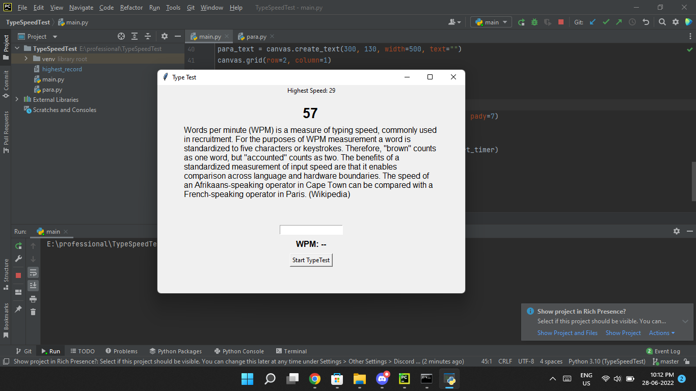

# TypeSpeedTest
Its GUI Based Project made using Tkinter

## Run Script
```
git clone https://github.com/viralRupani/Type-Test
cd Type-Test
python main.py
```

## Example


<i>In this GUI app you will Get 60 sec to complete Para as much as possible and according to how many words Typed, Typing Speed will be Calculated</i>